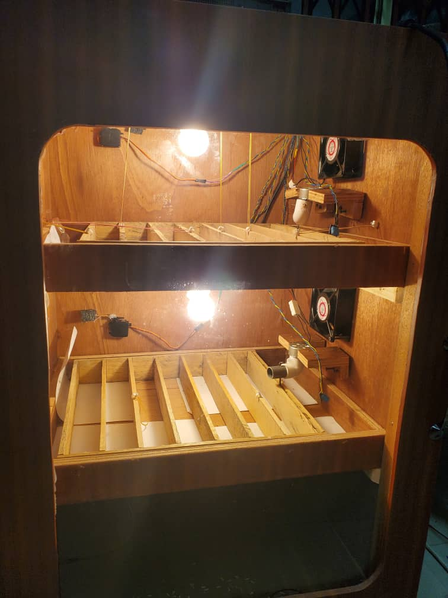

# Automatic Chicken Egg Incubator

## Table Of Content
  - [Image](#image)
  - [Purpose](#purpose)
  - [Hardware Tools](#hardware-tools)
  - [Software Technologies](#software-technologies)
  - [Hardware Explanation](#hardware-explanation)
  - [Concept](#concept)
  - [Problems Faced](#problems-faced)
  - [Fixes To The Problem](#fixes-to-the-problem)
    - [Solution to the first problem](#solution-to-the-first-problem)
    - [Posible solution for second problem](#posible-solution-for-second-problem)

## Image

 

## Purpose
To replicate the natural process chickens use to keep the eggs warm to promote good growth before hatching.

 

## Hardware Tools
- Raspberry Pi (Brain)
- 220V DC motors (x2)
- 12V DC motors (x2)
- Nails
- Screws
- Wooden frame
- Incandescent bulb (x2)
- DHT11 (x2)

 

## Software Technologies
- Python programming language
- Adafruit.io cloud service

 

## Hardware Explanation
The frame of the system has three compartments. The first two compartments hold the trays that have the eggs. These trays consist of racks which can move in one dimension and this causes the eggs to roll when the 12V motor moves them.

 

The last compartment holds the water trough which was placed to raise the humidity level of the system.

 

## Concept
The system is designed to house chicken eggs for incubation. The light bulbs provide heat to the eggs. So as not to overheat a portion of the eggs, the 12V DC motors turn the eggs at regular and pre-determined intervals.

 

The heat and humidity are monitored by the DHT11s. When the heat exceeds a threshold of 32 degrees celcius, the light bulb goes off and the 220V DC fan turns on to blow out the excess heat through tiny vents on the back of the frame.  

 

## Problems Faced
1. Getting the motor to move the trays was a bit of a hussle because the friction caused by the two wood pieces rubbing against each other was quite greater than the strength of the motor.
2. Humidity levels were very low in the system because the heat from the light bulb was not getting direct contact to the water in the last compartment to get the water evaporated.

 

## Fixes To The Problem
### Solution to the first problem
1. Papers were put under the rack to reduce the friction.
2. Also for the top compartment, rubber ties were used to elevate the rack a little so as to further reduce the friction.
   
### Posible solution for second problem
1. Wetting rice husks and putting them in the beds so that the light bulb heat could touch them directly in order to evaporate it and increase the humidity.
